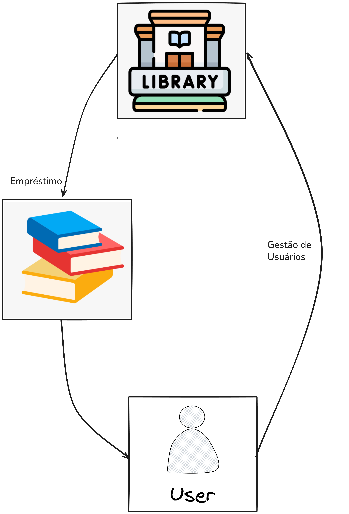

# Sistema de Biblioteca POO em Python

Este é um sistema de gerenciamento de biblioteca implementado com Programação Orientada a Objetos (POO) em Python. O projeto permite gerenciar livros, usuários e empréstimos, simulando um sistema de biblioteca funcional.

## Sumário

- [Tecnologias Utilizadas](#tecnologias-utilizadas)
- [Status](#status)
- [Descrição](#descrição)
- [Funcionalidades](#funcionalidades)
- [Explicação](#explicação)
- [Como Usar](#como-usar)
- [Autor](#autor)

## Descrição

Este projeto permite o gerenciamento básico de uma biblioteca, ele possuiu os seguites funcionalidades: 

* 1. `Gestão do Acervo`

* 2. `Gestão de Usuários`

* 3. `Operações de Empréstimo`

* 4. `Consultas e Relatórios`

  

Para implementar essas funcionalidades, o nosso porjeto conta com as seguintes classes fundamentais:

1.  **O Item do Acervo:** Aquilo que a biblioteca empresta. Pode ser um livro, uma revista, um filme, etc.
2.  **O Usuário:** A pessoa que pega um item emprestado.
3.  **O Empréstimo:** O ato que conecta um `Usuário` a um `Item` por um período.
4.  **A Biblioteca:** A entidade central que gerencia todo o acervo, os usuários e os empréstimos.

Isso nos leva naturalmente às seguintes classes principais: `ItemAcervo`, `Usuario`, `Emprestimo` e `Biblioteca`.

## Funcionalidades

- Adicionar, listar e remover livros da biblioteca.
- Adicionar, listar e remover usuários.
- Registrar empréstimos e devoluções de livros.
- Exibir um boletim de usuários e livros com status atualizado.

## Explicação

O projeto segue os princípios de Programação Orientada a Objetos (POO), separando as classes e funções para diferentes operações. As principais classes e funções incluem:

- **Livro**: Classe que representa um livro com título e autor.
- **Usuario**: Classe que representa um usuário com nome e idade.
- **Biblioteca**: Classe que gerencia o inventário de livros e empréstimos.
- **Emprestimo**: Classe que lida com a lógica de empréstimos e devoluções de livros.
- **Controller**: Controladores para gerenciar as operações de livro e usuário.

## Autor

Desenvolvido por Diego Franco
