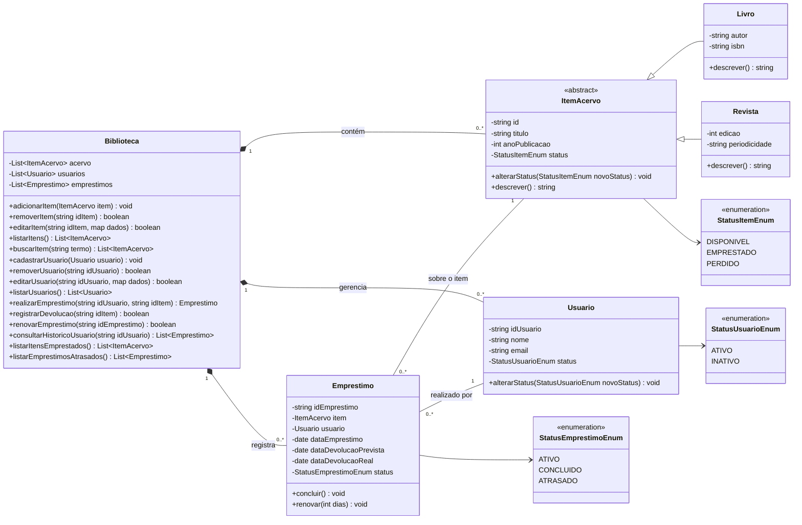
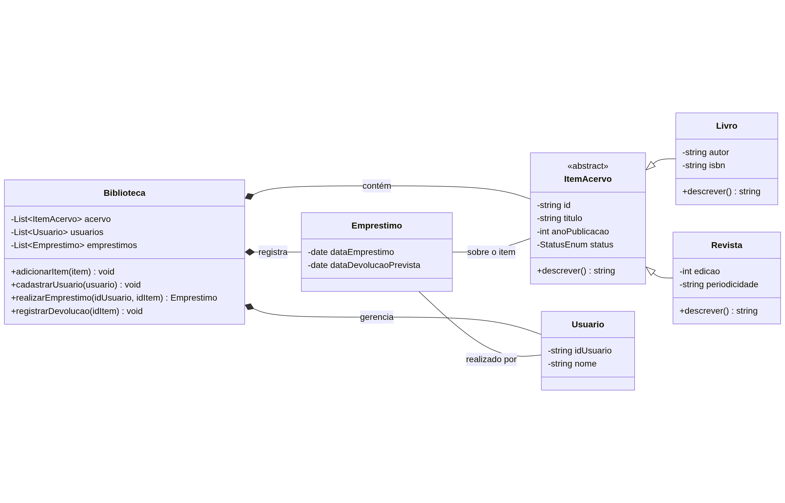

# Sistema de Biblioteca POO em Python

Este é um sistema de gerenciamento de biblioteca implementado com Programação Orientada a Objetos (POO) em Python. O projeto permite gerenciar livros, usuários e empréstimos, simulando um sistema de biblioteca funcional.

## Sumário

- [Tecnologias Utilizadas](#tecnologias-utilizadas)
- [Status](#status)
- [Descrição](#descrição)
- [Funcionalidades](#funcionalidades)
- [Explicação](#explicação)
- [Como Usar](#como-usar)
- [Autor](#autor)

## Descrição

Este projeto permite o gerenciamento básico de uma biblioteca, ele possuiu os seguites funcionalidades: 

* 1. `Gestão do Acervo`

* 2. `Gestão de Usuários`

* 3. `Operações de Empréstimo`

* 4. `Consultas e Relatórios`

  

Para implementar essas funcionalidades, o nosso porjeto conta com as seguintes classes fundamentais:

1.  **O Item do Acervo:** Aquilo que a biblioteca empresta. Pode ser um livro, uma revista, um filme, etc.
2.  **O Usuário:** A pessoa que pega um item emprestado.
3.  **O Empréstimo:** O ato que conecta um `Usuário` a um `Item` por um período.
4.  **A Biblioteca:** A entidade central que gerencia todo o acervo, os usuários e os empréstimos.

As classes são intituladas como: `ItemAcervo`, `Usuario`, `Emprestimo` e `Biblioteca`. Nosso diagrama UML de classes fica desta maneira:

<!-- 

  

 
-->

## Funcionalidades Detalhadas

Com base na nossa arquitetura e no objetivo do sistema, podemos dividir as funcionalidades em quatro grandes grupos. Cada funcionalidade representa uma ação que o sistema deve ser capaz de executar.

### 1. Gestão do Acervo

Funcionalidades focadas na administração dos itens que a biblioteca possui. São operações tipicamente realizadas por um bibliotecário.

* **Cadastrar Novo Item:** Adicionar um novo livro, revista ou outro tipo de item ao acervo do sistema. É a porta de entrada para qualquer item na biblioteca.
* **Remover Item:** Excluir um item do acervo, seja por dano, perda ou por estar obsoleto. Mantém o catálogo de itens relevantes atualizado.
* **Editar Dados de um Item:** Corrigir ou atualizar informações de um item já cadastrado, como título, autor ou ano de publicação. Garante a precisão dos dados.
* **Listar Todos os Itens:** Exibir uma lista completa de todos os itens no acervo, permitindo uma visão geral do que a biblioteca oferece.

### 2. Gestão de Usuários

Funcionalidades para administrar os membros da biblioteca.

* **Cadastrar Novo Usuário:** Registrar uma nova pessoa no sistema, permitindo que ela pegue itens emprestados.
* **Remover/Inativar Usuário:** Remover ou marcar um usuário como inativo, impedindo futuras operações. Útil quando um usuário se desliga da biblioteca.
* **Editar Dados de um Usuário:** Atualizar informações cadastrais, como nome ou contato.
* **Listar Todos os Usuários:** Exibir a base de todos os usuários cadastrados no sistema.

### 3. Operações de Empréstimo

Este é o coração do sistema, gerenciando o fluxo de entrada e saída de itens.

* **Realizar Empréstimo de um Item:** A funcionalidade principal. Associa um `Item` a um `Usuário` por um período determinado. O sistema deve validar se o item está disponível e se o usuário está apto a realizar o empréstimo.
* **Registrar Devolução de um Item:** Desvincular o item do usuário e atualizar seu status para "Disponível", permitindo que outras pessoas possam pegá-lo emprestado.
* **Renovar Empréstimo:** Estender o prazo de devolução de um item, caso não haja reservas para ele.

### 4. Consultas e Relatórios

Funcionalidades que permitem extrair informações e inteligência do sistema. Essenciais tanto para usuários quanto para administradores.

* **Buscar Item (por título, autor, etc.):** A ferramenta de pesquisa principal, permitindo que os usuários encontrem itens específicos no acervo.
* **Consultar Histórico de Empréstimos de um Usuário:** Listar todos os empréstimos (atuais e passados) de um usuário específico.
* **Listar Itens Emprestados:** Exibir todos os itens que estão atualmente com algum usuário, incluindo quem o pegou e a data de devolução prevista.
* **Listar Empréstimos Atrasados:** Gerar um relatório de todos os empréstimos cuja data de devolução já expirou. Esta é uma ferramenta administrativa crucial.

Para começar o desenvolvimento (MVP - Produto Mínimo Viável), as funcionalidades mais críticas seriam: **Cadastrar Item**, **Cadastrar Usuário**, **Realizar Empréstimo** e **Registrar Devolução**. As demais podem ser construídas a partir deste núcleo funcional.

## Autor

Desenvolvido por Diego Franco
